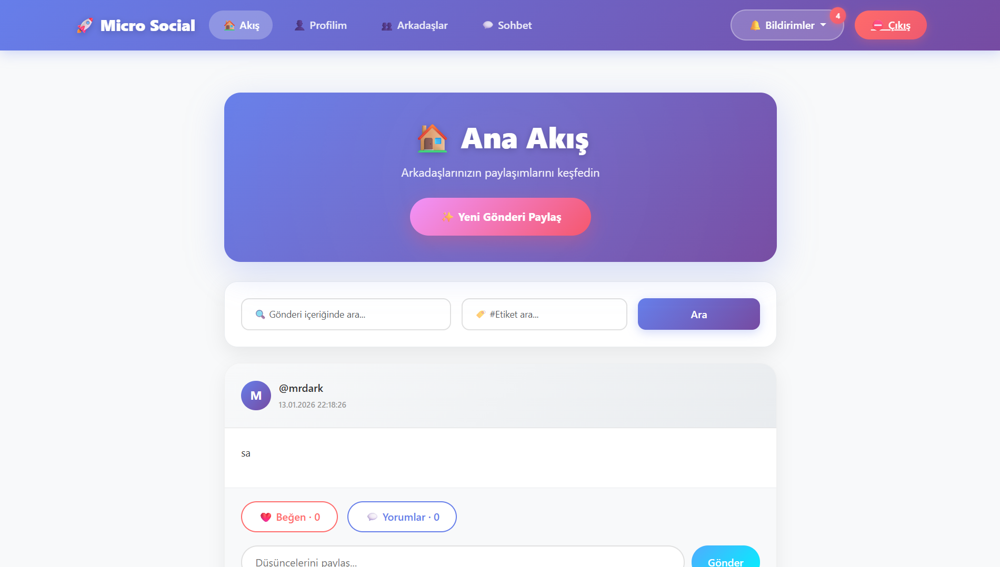
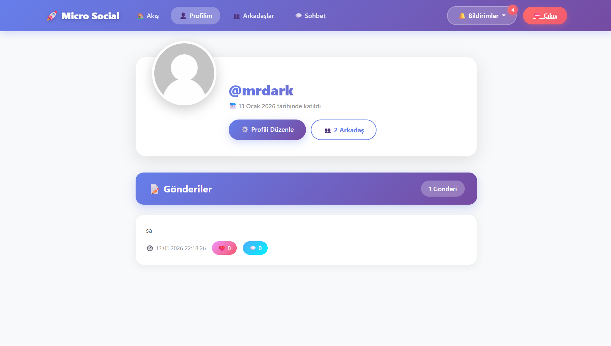
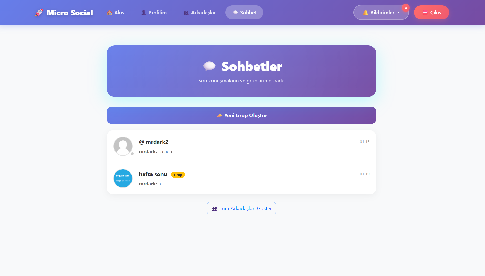
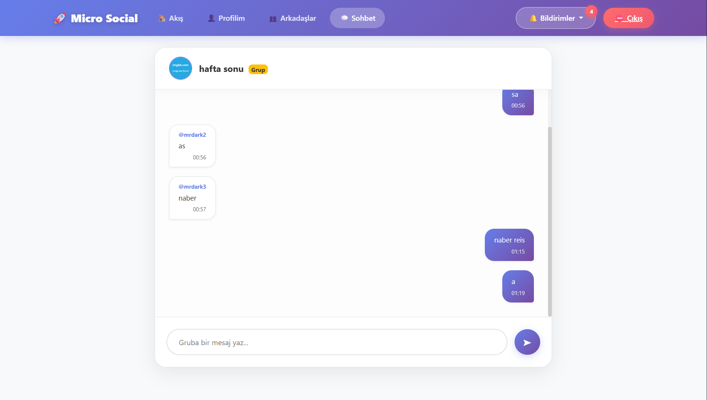
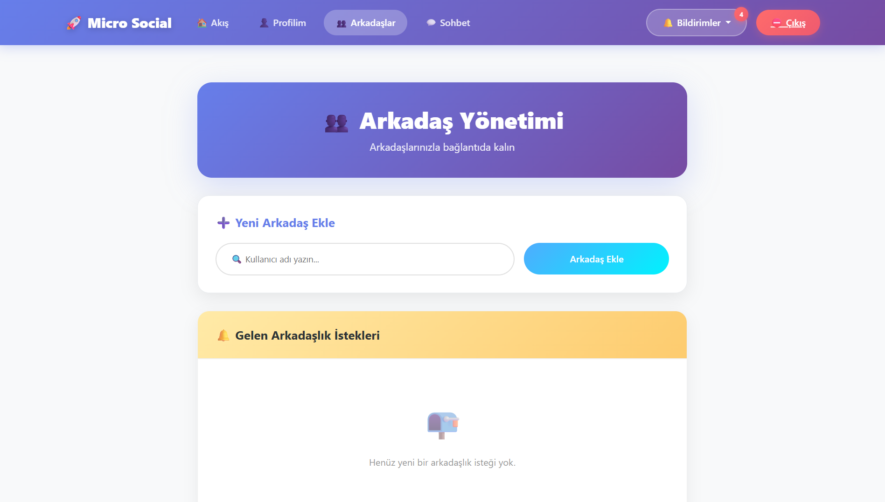

# 🚀 Micro Social

Modern ve kullanıcı dostu bir sosyal medya platformu. Arkadaşlarınızla bağlantıda kalın, düşüncelerinizi paylaşın, topluluklar oluşturun ve gerçek zamanlı sohbet edin!


## 📸 Ekran Görüntüleri

### Ana Akış


### Profil Sayfası


### Sohbetler


### Mesajlaşma


### Arkadaşlar


## ✨ Özellikler

- 📝 **Gönderi Paylaşımı** - Düşüncelerinizi paylaşın, gönderiler oluşturun.
- 💬 **Gerçek Zamanlı Sohbet** - Socket.IO destekli anlık birebir mesajlaşma.
- 👥 **Grup Sohbetleri** - Topluluklar kurun, gruplarda sohbet edin.
- 🤝 **Arkadaş Sistemi** - Arkadaş ekleme, istek gönderme ve kabul etme.
- 🔔 **Bildirimler** - Mesajlar, beğeniler ve arkadaşlık istekleri için anlık bildirimler.
- 👤 **Profil Yönetimi** - Profil resmi, kapak fotoğrafı ve biyografi özelleştirme.
- ❤️ **Etkileşimler** - Gönderileri beğenme ve yorum yapma.
- 🔍 **Arama & Etiket** - Gelişmiş arama ve hashtag (#etiket) desteği.
- 🎨 **Modern Arayüz** - Responsive tasarım, gradient renkler ve animasyonlar.

## 🛠️ Teknolojiler

- **Backend:** Node.js, Express.js (v5)
- **Veritabanı:** npm.db (JSON tabanlı)
- **Real-time:** Socket.IO
- **Frontend:** EJS, Bootstrap 5, Vanilla CSS
- **Modüler Yapı:** Ayrıştırılmış Router ve Socket Handler yapısı

## 📂 Proje Yapısı

```
micro-social/
├── routes/             # Express rotaları (Auth, API)
├── socket/             # Socket.IO olay işleyicileri
├── utils/              # Yardımcı fonksiyonlar (Helpers)
├── views/              # EJS şablonları (Sayfalar ve Partial'lar)
├── public/             # Statik dosyalar (CSS, JS, Resimler)
├── db.js               # Veritabanı bağlantı modülü
├── index.js            # Ana sunucu dosyası
└── database.json       # Veri saklama dosyası
```

## 🚀 Kurulum

1.  Projeyi indirin:
    ```bash
    git clone https://github.com/kullaniciadi/micro-social.git
    cd micro-social
    ```

2.  Bağımlılıkları yükleyin:
    ```bash
    npm install
    ```

3.  Uygulamayı başlatın:
    ```bash
    node index
    ```

4.  Tarayıcıda açın:
    `http://localhost:3000`

## � API Kullanımı

Uygulama dışından verilere erişmek için API uç noktaları mevcuttur.

**Base URL:** `/api`

| Method | Endpoint | Açıklama |
| :--- | :--- | :--- |
| `GET` | `/?token=KEY` | Veritabanındaki tüm verileri getirir. |
| `GET` | `/?token=KEY&key=users` | Belirli bir tabloyu (örn: users) getirir. |

*Güvenlik Notu: API kullanımı için `routes/api.js` içinde tanımlı token gereklidir.*

## 📄 Lisans

Bu proje MIT lisansı altında lisanslanmıştır.

---
**Geliştirici:** MrDark
